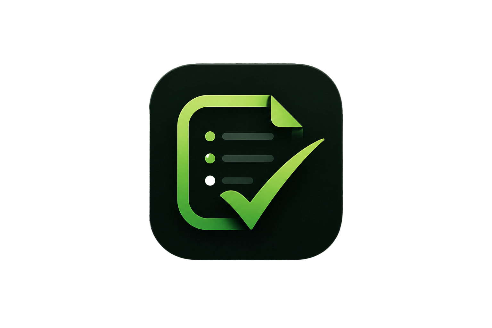

<div align="center">
  

## TaskFlow

**Organize. Focus. Deliver.**

TaskFlow is a full-stack task management app built with the MERN stack (MongoDB, Express, React, Node.js). It lets you register, log in, and manage your daily tasks with priorities, statuses, categories, and due dates — with a live dashboard summarizing your progress.

## Screenshots


## Features

- **Authentication** — JWT-based register/login, protected routes
- **Task management** — create, edit, delete tasks with title, description, category, priority, and due date
- **Dashboard** — live stats (total, completed, pending tasks)
- **Search & filter** — find tasks by keyword or status (All / Pending / Done)
- **Responsive UI** — dedicated mobile layout with bottom navigation, desktop sidebar layout
- **Profile** — view and update your account details

## Tech Stack

**Frontend**
- React (Vite)
- React Router
- Tailwind CSS
- Axios
- Framer Motion

**Backend**
- Node.js / Express
- MongoDB with Mongoose
- JWT for authentication
- bcrypt for password hashing

## Project Structure

```
Task-Manager/
├── client/          # React frontend (Vite)
│   └── src/
│       ├── components/
│       ├── context/     # AuthContext
│       ├── layouts/
│       ├── pages/
│       └── services/    # API layer (axios)
└── server/          # Express backend
    ├── config/          # DB connection
    ├── controllers/
    ├── middleware/      # JWT auth middleware
    ├── models/
    └── routes/
```

## Getting Started

### Prerequisites

- Node.js **20 or 22 LTS** (Node 24 currently has a known TLS/SSL compatibility issue with the MongoDB driver — see [Known Issues](#known-issues))
- A MongoDB Atlas cluster (or local MongoDB instance)

### 1. Clone the repo

```bash
git clone https://github.com/FREDDY2002835/Task-Manager
cd Task-Manager
```

### 2. Backend setup

```bash
cd server
npm install
```

Create a `.env` file in `/server`:

```env
MONGO_URI=mongodb+srv://<username>:<password>@<cluster-url>/taskflow?retryWrites=true&w=majority&appName=Cluster0
JWT_SECRET=your_jwt_secret_here
PORT=5000
```

> In MongoDB Atlas, make sure your current IP is added under **Network Access → IP Access List**, or the connection will be refused.

Run the server:

```bash
npm run dev
```

### 3. Frontend setup

```bash
cd client
npm install
```

Optionally, create a `.env` in `/client` if your backend isn't on the default:

```env
VITE_API_URL=http://localhost:5000/api
```

Run the frontend:

```bash
npm run dev
```

The app should now be running at `http://localhost:5173` (or whatever port Vite reports), connected to the API at `http://localhost:5000/api`.

## API Overview

| Method | Endpoint          | Description                  | Auth required |
|--------|-------------------|-------------------------------|:---:|
| POST   | `/api/auth/register` | Register a new user        |  |
| POST   | `/api/auth/login`    | Log in, returns JWT         |  |
| GET    | `/api/auth/me`        | Get current user profile   | ✅ |
| PUT    | `/api/auth/me`        | Update current user profile | ✅ |
| GET    | `/api/tasks`          | List tasks (supports `?search=` & `?status=`) | ✅ |
| POST   | `/api/tasks`          | Create a task               | ✅ |
| GET    | `/api/tasks/:id`      | Get a single task           | ✅ |
| PUT    | `/api/tasks/:id`      | Update a task                | ✅ |
| DELETE | `/api/tasks/:id`      | Delete a task                | ✅ |
| GET    | `/api/tasks/stats`    | Get task counts for dashboard | ✅ |

## Known Issues

- **Node 24 + MongoDB Atlas SSL error**: connecting with Node 24 can throw a TLS handshake error (`SSL alert number 80`). Use Node 20 or 22 LTS instead until the MongoDB driver has broader Node 24 support.
- **DNS SRV resolution on Windows**: some Windows/network setups fail to resolve the `mongodb+srv://` DNS record (`querySrv ECONNREFUSED`). The backend forces Node's DNS resolver to use public DNS servers (`8.8.8.8`, `1.1.1.1`) in `config/db.js` to work around this.

## License

This project is currently unlicensed. Add a license of your choice (e.g. MIT) before making the repo public if you'd like others to reuse the code.
